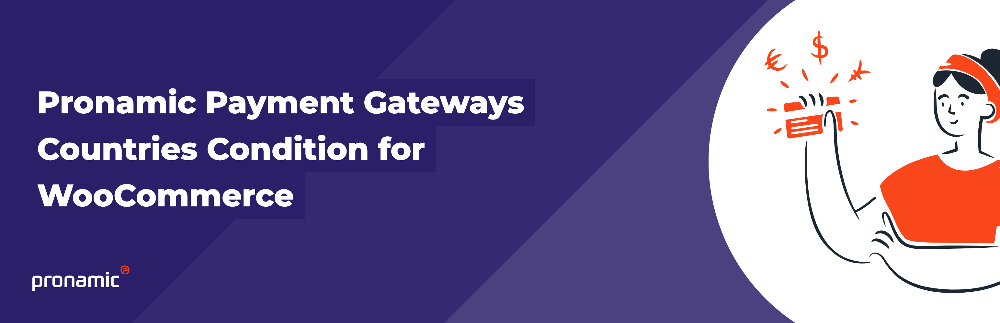
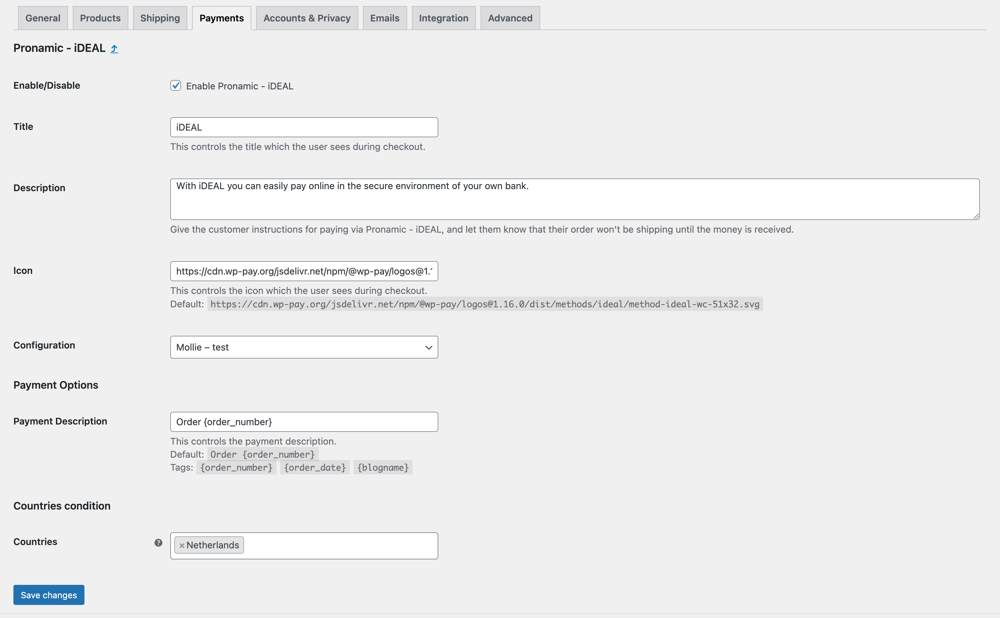

<p align="center"></p>

# Pronamic Payment Gateways Countries Condition for WooCommerce

[](https://packagist.org/packages/pronamic/pronamic-payment-gateways-countries-condition-for-woocommerce)
[](https://packagist.org/packages/pronamic/pronamic-payment-gateways-countries-condition-for-woocommerce)
[](https://packagist.org/packages/pronamic/pronamic-payment-gateways-countries-condition-for-woocommerce)
[](https://packagist.org/packages/pronamic/pronamic-payment-gateways-countries-condition-for-woocommerce)
[](https://packagist.org/packages/pronamic/pronamic-payment-gateways-countries-condition-for-woocommerce)

- [Introduction](#introduction)
- [Benefits](#benefits)
- [Features](#features)
- [Installation](#installation)
- [Screenshots](#screenshots)
- [Links](#links)

## Introduction

This plugin allows you to specify the countries in which each WooCommerce payment gateway is available. This is useful for businesses that want to offer different payment methods to customers in different countries.

## Benefits

This simple, high-quality plugin adds a setting to all WooCommerce payment gateways to limit payment gateways to specific countries.
The plugin was built by the Frisian/Dutch web agency Pronamic with WordPress experience since 2005.
Users of this plugin can count on Pronamic's excellent service and experience.

## Features

- Easily specify the countries in which each payment gateway is available
- Supports all WooCommerce payment gateways
- Simple to use

## Installation

```
composer require pronamic/pronamic-payment-gateways-countries-condition-for-woocommerce
```

```php
\Pronamic\WooCommercePaymentGatewaysCountriesCondition\Plugin::instance()->setup();
```

## Screenshots



## Links

- https://www.pronamic.eu/

[](https://www.pronamic.eu/contact/)
